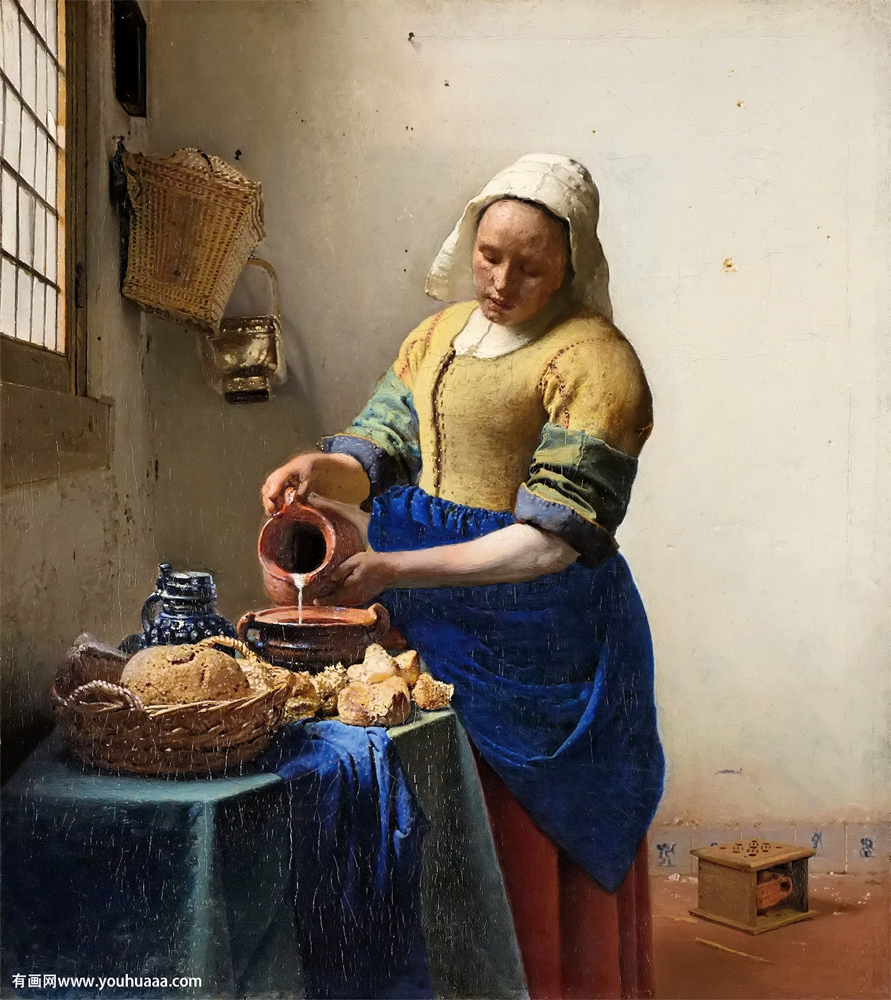
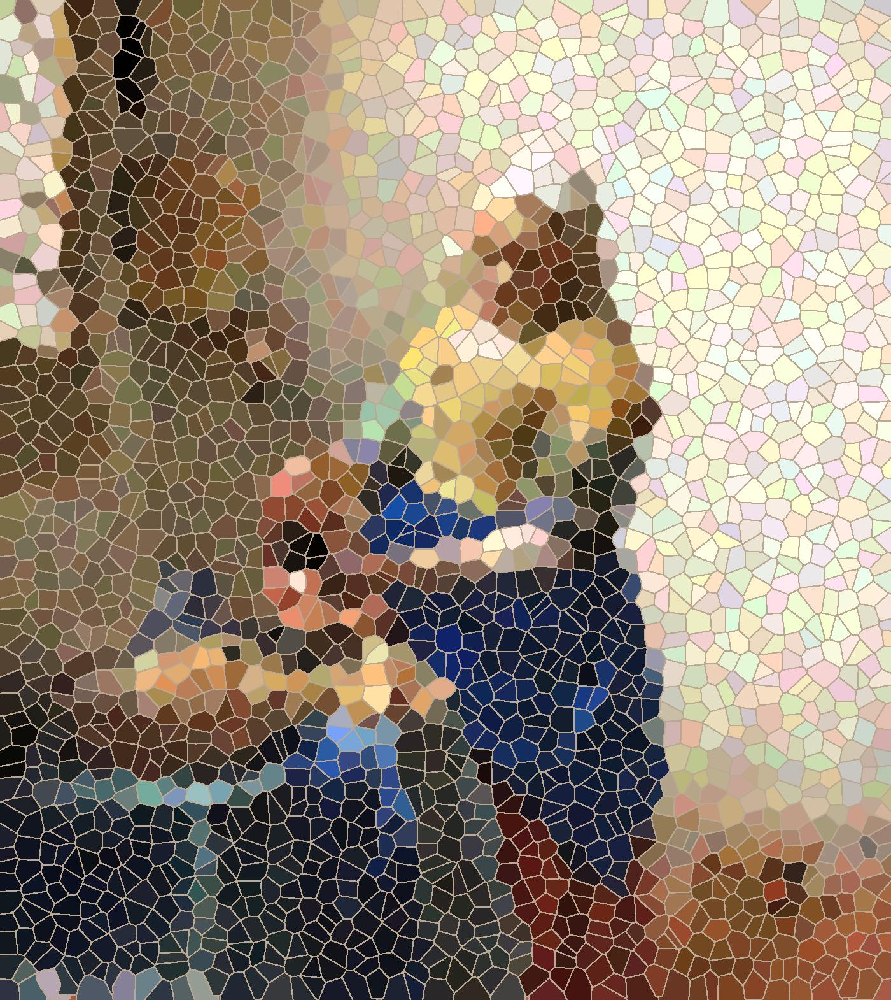
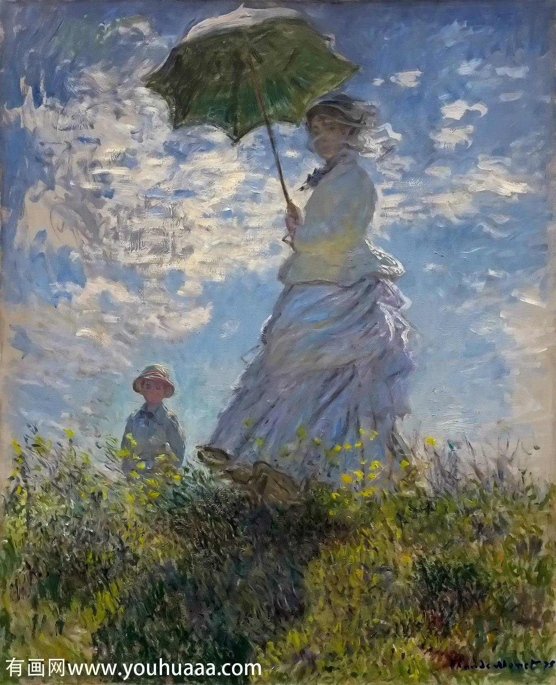
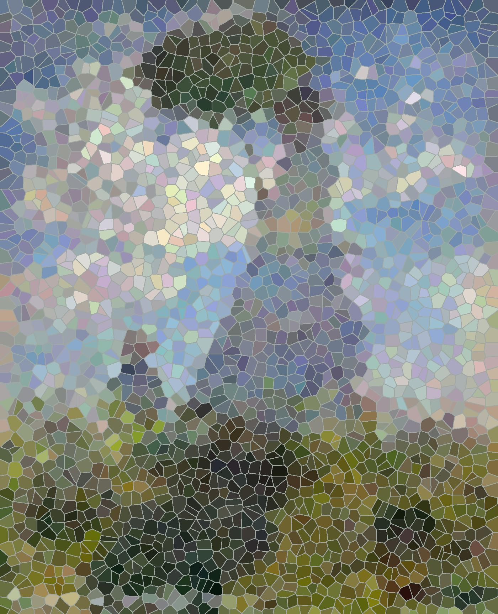
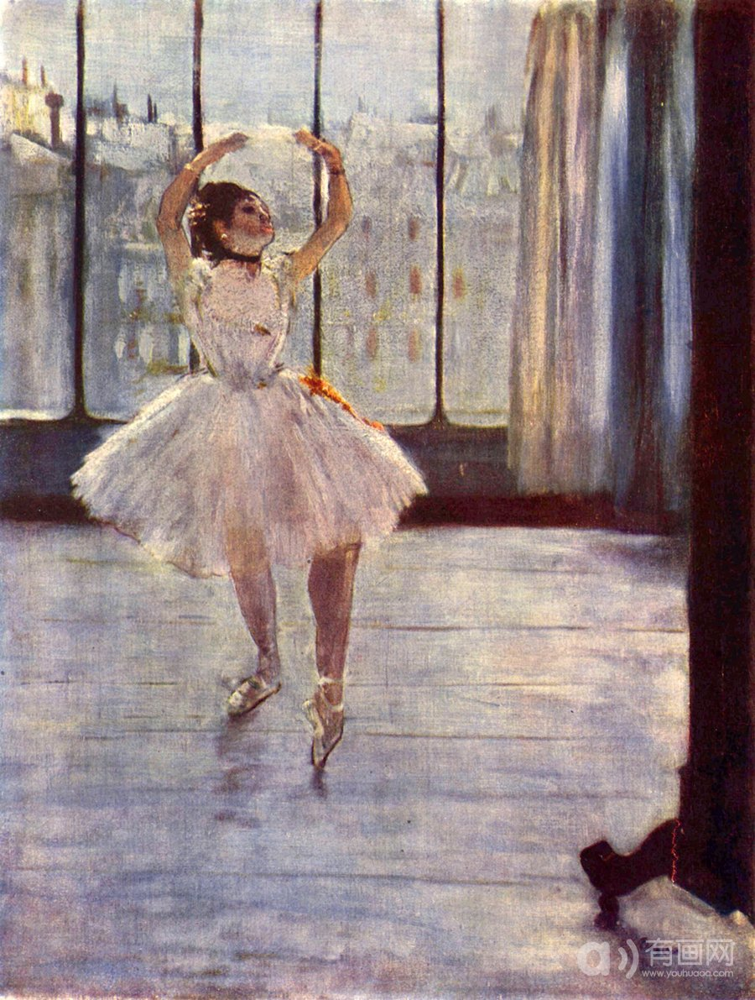

# stain glass image style 

## usage:
### [1] Pictures should be put into **image** which with `jpg` file format

### [2] run **demo.m**

### [3] check the results in **result** 


- You can change the input format on **line 3**:
    ```
    img_path=dir(fullfile('./image/*.jpg'));
    ```

- change the window size on **line 9**, which dependents on image size:
    ```
    WIN=round(sqrt(H*W)/50);
    ```
- change the crack color on **line 71** which dependents on average color of the whole picture:
    ```
    IR(label_edge)=bmR*1.3;
    IG(label_edge)=bmG*1.3;
    IB(label_edge)=bmB*1.3;
    ```
- the glass hue blend with a random intensity light, you can change the intensity ratio on **line 53**:
    ```
    chC=abs(rand(SEED,3))./5;
    ```

I'll put a simple process on my [bolg](www.kanvasesfan.com) in recent days.





